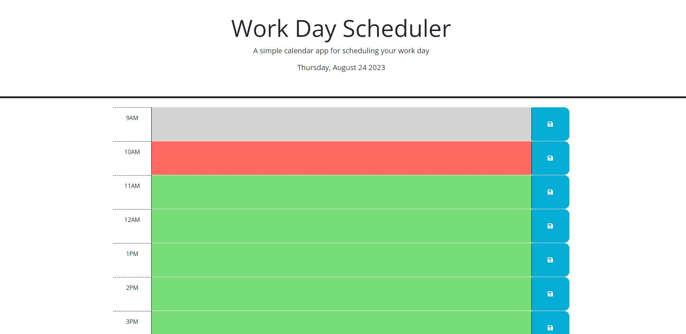

# schedule-planner

## Description

A work day schedule planner made using html, css, javascript, jquery, dayjs and making 
use of assets from font awesome and google fonts. The program will display the date in
the header of the page as the day of the week, month, day then year. On the main
content of the page a series of time blocks for the hours from 9 AM to 5 PM. Every 15
seconds the page checks the time and updates each time block based on if it has passed,
if it is the current hour, or if its in the future.

## Installation

GitHub Pages link: https://prosentint.github.io/schedule-planner/

## Usage

Each time block displayed in index.html contains a textbox and save button. You can write
tasks needed to be done during that hour or completed by that hour to keep track of a 
work day schedule. Clicking the save button on a time block will ensure that whatever is
currently displayed in the time block will be saved in local memory to be displayed even
on page refresh.

## Credits

N/A

## License

Copyright (c) 2023 Prosentint

Permission is hereby granted, free of charge, to any person obtaining a copy
of this software and associated documentation files (the "Software"), to deal
in the Software without restriction, including without limitation the rights
to use, copy, modify, merge, publish, distribute, sublicense, and/or sell
copies of the Software, and to permit persons to whom the Software is
furnished to do so, subject to the following conditions:

The above copyright notice and this permission notice shall be included in all
copies or substantial portions of the Software.

THE SOFTWARE IS PROVIDED "AS IS", WITHOUT WARRANTY OF ANY KIND, EXPRESS OR
IMPLIED, INCLUDING BUT NOT LIMITED TO THE WARRANTIES OF MERCHANTABILITY,
FITNESS FOR A PARTICULAR PURPOSE AND NONINFRINGEMENT. IN NO EVENT SHALL THE
AUTHORS OR COPYRIGHT HOLDERS BE LIABLE FOR ANY CLAIM, DAMAGES OR OTHER
LIABILITY, WHETHER IN AN ACTION OF CONTRACT, TORT OR OTHERWISE, ARISING FROM,
OUT OF OR IN CONNECTION WITH THE SOFTWARE OR THE USE OR OTHER DEALINGS IN THE
SOFTWARE.